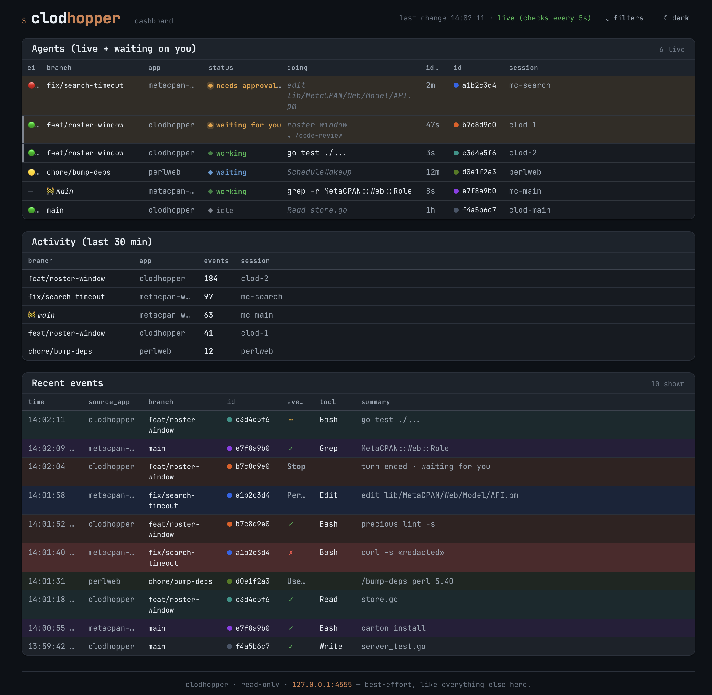

# clodhopper


A small, project-agnostic observability tool for Claude Code. It captures
lifecycle events from any project's hooks into a local SQLite database and
serves a read-only, per-host dashboard.



Built as the "lightweight, inspiration-only" outcome of an evaluation of
[disler/claude-code-hooks-multi-agent-observability](https://github.com/disler/claude-code-hooks-multi-agent-observability):
same idea (see what your agents are doing across concurrent sessions), but on
the Go + SQLite stack, with secret scrubbing and bounded retention built in, and
no dependency on a running server for capture.

## Design in one breath

```
Claude Code hook (event JSON on stdin)
   -> clodhopper ingest --source-app NAME    # fast, scrubs secrets, writes one row
        -> ~/.claude/clodhopper/var/events.db (SQLite, WAL)

clodhopper serve    # run only when you want to look
   -> read-only dashboard on http://127.0.0.1:4555
```

Capture (write) and viewing (read) are decoupled through the shared SQLite file.
The dashboard being down never loses events; `ingest` never depends on a server.

## Quickstart

Up and running in about five minutes:

```bash
# 1. Install the binary (see Install for manual download / build-from-source).
ubi --project oalders/clodhopper --in ~/.local/bin

# 2. From a project's root, wire the capture hooks into its Claude Code settings.
cd /path/to/your/project
clodhopper init --project        # writes .claude/settings.json (idempotent)

# 3. Use Claude Code in that project as normal — events start flowing immediately.

# 4. When you want to look, start the dashboard:
clodhopper serve                 # http://127.0.0.1:4555
```

That's the whole loop: hooks capture in the background, and `serve` is a
read-only viewer you run on demand. The sections below cover install options,
the env-var config table, exactly what is (and isn't) captured, and wiring
details.

## Install

Prebuilt binaries for macOS, Linux, and Windows (amd64 + arm64) are attached to
every [release](https://github.com/oalders/clodhopper/releases/latest) — no
toolchain or C compiler required.

### With `ubi` (recommended)

[`ubi`](https://github.com/houseabsolute/ubi), the Universal Binary Installer,
picks the right release asset for your platform and installs it in one step:

```bash
ubi --project oalders/clodhopper --in ~/.local/bin   # any directory on your PATH
```

### Download a release manually

Grab the archive for your platform, extract the `clodhopper` binary, and drop it
anywhere on your `PATH`.

```bash
# Linux x86_64 — bump VERSION to the latest tag on the releases page
VERSION=0.0.6
curl -sSL "https://github.com/oalders/clodhopper/releases/download/v${VERSION}/clodhopper_${VERSION}_linux_amd64.tar.gz" \
  | tar -xz clodhopper
mv clodhopper ~/.local/bin/   # or any directory on your PATH
```

Archives follow `clodhopper_<version>_<os>_<arch>.{tar.gz,zip}`; verify a
download against the release's `checksums.txt`.

### Build from source

```bash
cd ~/.claude/clodhopper
go install ./...        # puts `clodhopper` on your PATH (GOBIN / $GOPATH/bin)
```

Building from source requires CGO (a C compiler) because it uses
`github.com/mattn/go-sqlite3`.

## Usage

```bash
clodhopper ingest --source-app myapp       # reads one hook event as JSON on stdin
clodhopper serve [--port 4555] [--host H | --tailscale] [--pane-peek [--pane-lines N]] [--enable-merge] # dashboard (read-only unless --enable-merge; default 127.0.0.1)
clodhopper prune [--days 14]              # delete events older than N days
clodhopper end --branch B                  # mark matching live sessions ended (teardown)
```

By default the dashboard binds `127.0.0.1` (loopback only). If your browser runs
on a different machine or namespace than the server (e.g. inside a container or
VM), bind all interfaces with `clodhopper serve --host 0.0.0.0` (or `CLODHOPPER_HOST=0.0.0.0`)
and reach it via that host's IP — note this exposes the dashboard to your LAN.
A bind that resolves to a public IP is refused unless `CLODHOPPER_ALLOW_PUBLIC=1`
(or `--allow-public`) is set, since the dashboard has no auth or TLS.

To reach the dashboard from your other devices without exposing it to the LAN,
bind it to your [Tailscale](https://tailscale.com) IP instead of `0.0.0.0`:

```bash
clodhopper serve --tailscale
```

`--tailscale` resolves the host's IPv4 tailnet address (`tailscale ip -4`) and
binds it, equivalent to `clodhopper serve --host "$(tailscale ip -4)"`. It
cannot be combined with `--host`. Unlike the rest of clodhopper, the lookup is
not best-effort: if `tailscale` is missing or the node is down, `serve` exits
non-zero rather than silently bind elsewhere.

This listens only on the tailnet interface, so the dashboard is reachable from
any device on your tailnet (subject to your ACLs) but not from the local
network. Reach it at `http://<this-host's-tailscale-ip>:4555`, or by the host's
MagicDNS name.

### Peeking at a live pane

- `--pane-peek` (default off): enable the **live tmux pane peek**. When set, each
  roster row whose Claude tmux pane is still alive shows a ⤢ control that expands
  the pane's last lines inline, fetched live from `tmux capture-pane`. Nothing is
  stored — the pane text exists only in the HTTP response.
- `--pane-lines` (default 40, range 1–2000): how many trailing lines a peek shows.

> **Exposure:** the peek streams **live terminal content** (your Claude
> conversation, code, and anything else on that pane, including pasted secrets) to
> whoever can reach the dashboard. It is redacted only best-effort by the same
> secret-shaped-substring scrubber used elsewhere — a denylist that can miss
> things — so it is **off by default** and should be enabled only where the
> dashboard itself is on a trusted network (e.g. bound to your Tailscale IP via
> `--tailscale`). The trust boundary is your tailnet, not the scrubber.

Worth knowing before you bind beyond loopback: the roster's branch cell shows
each session's absolute worktree path on hover and copies it on click, so
anyone who can load the dashboard can read your directory layout — which
usually means your OS username and your project or client names. That is the
point of the affordance (it is how you get to the agent), and the board has no
auth either way, but it is a little more than the branch and app names the
board used to expose.

### Merging PRs from the dashboard

- `--enable-merge` (default off): turn on the roster's **PR-action buttons**.
  When set, each roster row gains squash / squash + admin / close / ready
  buttons — plus a **rebase** button and an **end** button that just dismisses
  the row — behind a two-step confirm. Clicking one runs your local `merge-pr`,
  `gh pr ready`, or `git` in that row's worktree — merging or closing the real PR,
  removing the worktree, and killing the row's tmux session, same as if you'd
  typed the command yourself. `--squash --admin` bypasses branch protection
  using your own `gh` authentication.

  Whatever address the server is bound to, every action that runs a command
  (the PR actions, the session actions, and **rebase**) is accepted only from a
  **loopback or Tailscale peer** — `127.0.0.0/8`, `::1`, `100.64.0.0/10`, or
  `fd7a:115c:a1e0::/48`. A LAN peer reaching a `--host 0.0.0.0` dashboard gets
  the read-only board and the **end** button (which execs nothing) and a `403`
  for anything else; the buttons it cannot use are not rendered for it. The
  peer address is taken from the connection only — forwarding headers such as
  `X-Forwarded-For` are never consulted — and there is no override flag.

The PR-action form on each row is a three-way radio (squash / close / ready)
plus two modifiers and a single **run** button:

- **squash** runs `merge-pr --squash`; **close** runs `merge-pr --close`;
  **ready** runs `gh pr ready` (non-destructive — the session keeps running).
- **`--admin`** (squash only) adds `--admin`, bypassing branch protection with
  your `gh` auth. **`--force`** (squash only) adds `--force`, merging even with
  uncommitted changes in the worktree. Both grey out unless squash is selected.
- The exact command it will run is shown inline, and **run** is a two-step
  confirm: the first click states the consequence, the second fires it — so a
  stray click can never trigger a merge or close.

The row cluster adds two more buttons, each with the same two-step confirm:

- **rebase** runs `git fetch origin BASE`, `git pull --rebase origin BASE`, then
  `git push --force-with-lease=BRANCH:SHA origin BRANCH` in that row's worktree —
  so the PR is actually updated. `BASE` is the repo's default branch, resolved
  server-side from `origin/HEAD`, falling back to `origin/main` / `origin/master`
  **only when exactly one of them exists** (both, with no `origin/HEAD`, is
  ambiguous and refuses); it is never supplied by the browser. The push names its
  refspec explicitly, so a `push.default = matching` config cannot widen it, and
  the lease is pinned to the `origin/BRANCH` SHA captured *before* the fetch, so
  a concurrent fetch cannot quietly defeat it. A branch with no remote-tracking
  ref is pushed without any force. **This rewrites the branch's history and
  force-pushes it.** If the rebase hits a conflict it is aborted (`git rebase
  --abort`, so the worktree is left clean), nothing is pushed, and the row reports
  that the branch needs a manual rebase — or, if the abort itself failed, that
  the worktree may be left mid-rebase. clodhopper refuses to run at all when the
  default branch cannot be resolved or is ambiguous, when the worktree is
  detached or mid-rebase, when it is sitting *on* the default branch, or when its
  branch is `main`/`master` whatever the default resolved to. The whole sequence
  is bounded by an overall deadline as well as a per-step one, and every attempt
  (including a refusal) writes one audit line to serve's stderr.
- **end** just dismisses the roster row; it never touches the repo or the agent.

When a row's Claude session is in a live tmux pane, it also gains two **session
actions** that drive that pane directly (they do not touch a PR):

- **monitor ci** sends `/clear` then `/monitor-ci` into the agent's own pane.
  This is **destructive**: `/clear` drops the agent's current context. The two
  are sent as separate keystroke batches with a short pause in between, because
  `/clear` makes the agent's TUI redraw its input line and keys arriving during
  that redraw are swallowed (notably in sandboxed sessions).
- **+ watcher** is additive: it opens a **new** pane in the existing tmux
  session running `nn claude`, then sends `/monitor-ci` to it, leaving the
  original agent untouched.

Every row — pane or no pane — also gains an **end** button. It is the dashboard
equivalent of `clodhopper end --session <id>`: it writes the synthetic
`SessionEnd` that drops the row from the roster, and does nothing else. No
process is killed and no repo is touched, so it is the way to clear a stale row
left behind by a hard-killed agent. The row comes back if that session ever
emits another event.

> **Exposure:** this is a **write** capability, not just a read one. It is
> gated behind CSRF (a custom header token, checked in constant time), a
> Host-header allowlist (`CLODHOPPER_ALLOWED_HOSTS`) that defends against DNS
> rebinding, and a closed argv allowlist — no free-form string from the
> request ever reaches a command line. None of that changes who it acts as: it
> runs with **your** credentials against **your** repos. The session actions
> additionally send **keystrokes into live tmux panes**. (**end** is the mild
> one: it only writes a row to clodhopper's own database.) Everything here is
> gated behind `--enable-merge` **and** restricted to loopback/Tailscale
> peers, so enable it only on a **trusted, single-operator network**
> (loopback, or your tailnet via `--tailscale`), never on a public bind.

### The debug view

By default the dashboard shows only the **roster** — the "which agent needs me"
board. The **Activity** and **Recent events** sections are diagnostics, hidden
unless you opt in: click **debug** in the header (or add `?debug=1` to the URL).
The choice persists across reloads and rides along with the other query params
(filters, refresh, roster window).

`ingest` is what hooks call. It is designed to **never** break a tool call: any
error (bad JSON, unwritable DB, …) results in exit 0, and diagnostics are
written to stderr only when `CLODHOPPER_DEBUG` is set.

### Tearing down agents from scripts

The roster treats a session as gone when it sees a `SessionEnd` event. A hard
kill — `tmux kill-session`, `kill -9`, a crash, or laptop sleep — gives Claude
Code no chance to emit `SessionEnd`, so the agent would otherwise linger as a
"waiting for you" zombie until the retention cap expires. If a script tears down
sessions that way, have it tell clodhopper first:

```bash
clodhopper end --branch "$branch"
```

This writes a synthetic `SessionEnd` for every live session on that branch. The
script never needs Claude's `session_id` — clodhopper resolves the branch (or
`--cwd`) to the live sessions itself. To reap one session by hand, pass
`--session` the id fragment the roster shows; it matches by prefix and refuses
(listing the candidates) if the fragment is ambiguous. Guard the call so it
no-ops where the binary is absent:

```bash
command -v clodhopper >/dev/null && clodhopper end --branch "$branch"
```

Switching the kill to a gentler signal is not a reliable alternative — Claude
Code only sometimes fires `SessionEnd` on `SIGTERM`/`SIGINT`, and a closing
pane's `SIGHUP` usually kills it before cleanup runs.

## Configuration (environment)

| Var | Default | Meaning |
|---|---|---|
| `CLODHOPPER_DB` | `~/.claude/clodhopper/var/events.db` | SQLite path. |
| `CLODHOPPER_RETAIN_DAYS` | `14` | Events older than this are pruned (opportunistically on ~1% of ingests, and on demand via `prune`). |
| `CLODHOPPER_DISABLED` | unset | `1` makes `ingest` a no-op. |
| `CLODHOPPER_PORT` | `4555` | Dashboard port. |
| `CLODHOPPER_HOST` | `127.0.0.1` | Dashboard bind address. Set `0.0.0.0` for container/LAN access. |
| `CLODHOPPER_ALLOW_PUBLIC` | unset | Set to `1` to allow `serve` to bind a public IP (refused by default; the dashboard has no auth or TLS). Also settable per-run with `--allow-public`. |
| `CLODHOPPER_ALLOWED_HOSTS` | unset | Comma-separated extra `Host:` header values accepted by the PR-action endpoint (e.g. a Tailscale MagicDNS name), beyond loopback and the bind host, which are always allowed. Only consulted when `--enable-merge` is set. It widens the accepted `Host:` header, NOT the accepted peer: actions that run commands still require a loopback or Tailscale peer address. |
| `CLODHOPPER_WAITING_RETAIN_HOURS` | `720` (30 days) | How long a session with no `SessionEnd` stays on the roster. The default is generous on purpose so a long-idle but still-alive agent (overnight, a weekend, a multi-day pause) stays visible. In practice this window is also bounded by `CLODHOPPER_RETAIN_DAYS` (default 14): pruned events leave the roster regardless, so raise both to keep a session visible beyond two weeks. Reap finished or hard-killed sessions explicitly with `clodhopper end` rather than relying on this timeout. The dashboard's **roster window** dropdown narrows the board per-view (e.g. to the last day) without changing this configured cap. |
| `CLODHOPPER_DEBUG` | unset | If set, `ingest` writes errors to stderr. |

## What gets captured (and what does not)

Each event row holds: timestamp, `source_app`, `cwd`, `session_id`,
`event_type`, `tool_name`, a short human `summary`, and the full **scrubbed**
event JSON.

Privacy guarantees:

- **No transcript / chat capture.** The hook's `transcript_path` file is never
  read. `prompt` fields are truncated to an 80-character preview.
- **Secret scrubbing before persistence**, in three layers:
  1. JSON string values under credential-shaped keys (`*token*`, `*secret*`,
     `*password*`, `*api_key*`, `*_key`, …) are redacted wholesale.
  2. Secret-shaped substrings anywhere are redacted: `NAME=value` /
     `NAME: value` credential assignments, `Authorization: Bearer/Basic …`,
     AWS access key IDs, GitHub tokens (`ghp_…`, `github_pat_…`), and PEM
     private-key blocks.
  3. The `summary` line is built from a per-tool allowlist (Bash → command,
     Read/Edit/Write → file path only) and is itself scrubbed.

Redactions appear as `«redacted»`.

## Wiring a project

The easiest way is `clodhopper init`, run from the project's root. It writes the
ingest hooks for every Claude Code lifecycle event into the project's settings,
idempotently (safe to re-run):

```bash
clodhopper init --project                 # -> .claude/settings.json (committed)
clodhopper init --local                   # -> .claude/settings.local.json (gitignored)
clodhopper init --project --dry-run       # preview without writing
```

With neither `--project` nor `--local` it prompts you to choose. `--source-app`
defaults to the git repo name (the *main* repo's name even from a linked
worktree, so it stays distinct from the branch); pass `--source-app NAME` to
override (required outside a git repo). The generated command is guarded so
environments without the binary simply no-op; `--guard command` (default) uses
the portable
`command -v clodhopper` check, `--guard is` uses the `is there clodhopper` helper.

`init` writes 2-space-indented JSON; the first run on an existing committed
settings file will re-sort its keys (a one-time noisy diff) — preview with
`--dry-run`.

Or, by hand: add hooks to the project's `.claude/settings.json` (or
`settings.local.json`). Guard on the binary existing so environments without
`clodhopper` simply no-op:

```json
{
  "hooks": {
    "PreToolUse": [
      { "hooks": [ { "type": "command",
        "command": "command -v clodhopper >/dev/null 2>&1 && clodhopper ingest --source-app myproject || true" } ] }
    ]
  }
}
```

`source_app` is a static label per project; finer grouping (worktree, session)
comes from the `cwd` / `session_id` already in each hook payload.

## Development

```bash
go test ./...   # requires CGO
go vet ./...
```

Runtime data lives under `var/` (gitignored).

### Linting and formatting

Linting is orchestrated by [precious](https://github.com/houseabsolute/precious),
which drives `gofmt`, `go vet`, and `golangci-lint` from one config
(`precious.toml`). The same checks run in the pre-commit hook and in CI, so a
formatting or lint slip fails the commit instead of the build.

Install the tools (any method works — they're plain release binaries). CI uses
[`ubi`](https://github.com/houseabsolute/ubi), which fetches prebuilt binaries
with no compile step:

```bash
# Bootstrap ubi itself (one time), if you don't already have it:
curl --silent --location \
  https://raw.githubusercontent.com/houseabsolute/ubi/master/bootstrap/bootstrap-ubi.sh \
  | TARGET=~/.local/bin sh

# Then the lint tools:
ubi --project houseabsolute/precious --in ~/.local/bin
ubi --project golangci/golangci-lint --tag v2.12.2 --in ~/.local/bin
```

Then:

```bash
precious lint --all    # check everything (what CI runs)
precious tidy --all    # auto-fix formatting in place
precious lint -s       # check only staged files (what the hook runs)
precious tidy -s       # auto-fix only staged files (hook failure suggests this)
```

Enable the pre-commit hook once per clone:

```bash
scripts/pre-commit --init
```

The hook runs `precious lint -s` on staged files and blocks direct commits to
`main`. If `precious` isn't on `PATH` it no-ops rather than blocking, so a clone
without it still works.
